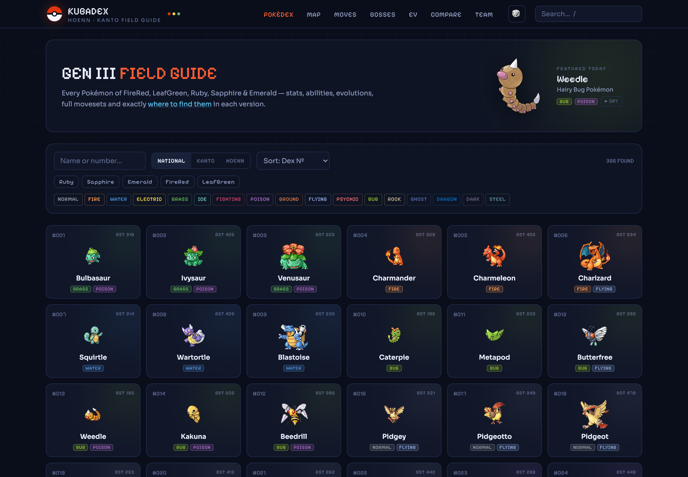
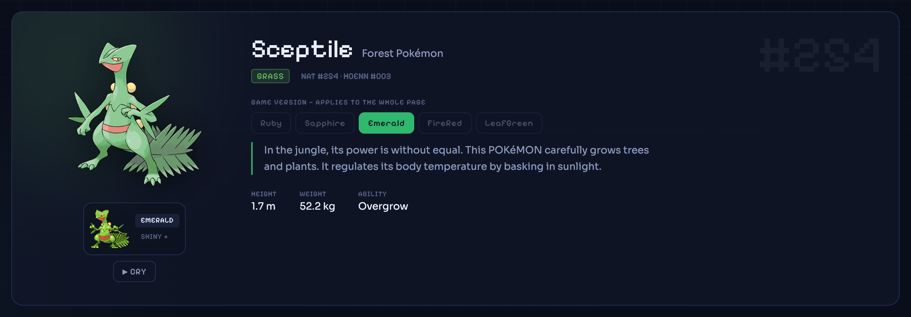
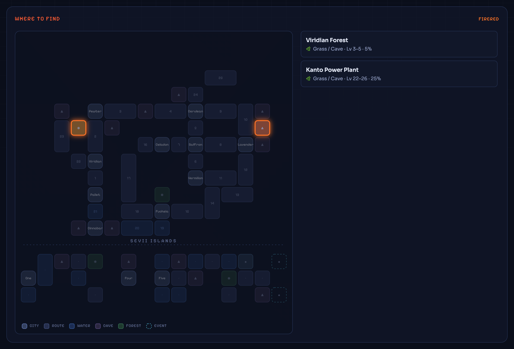
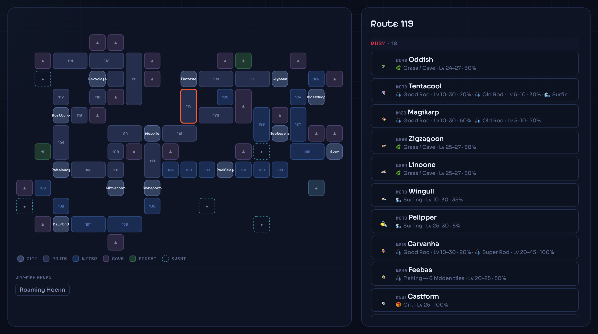
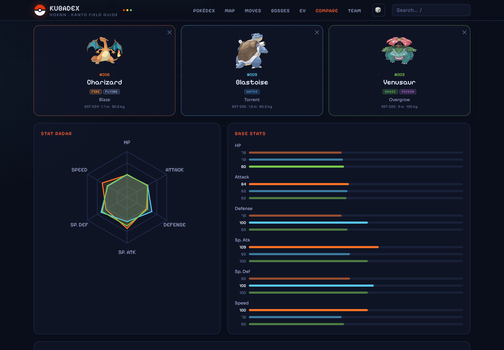
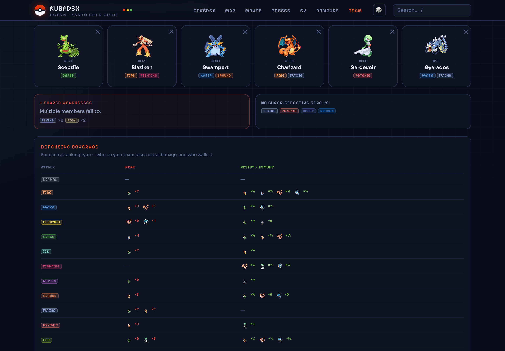
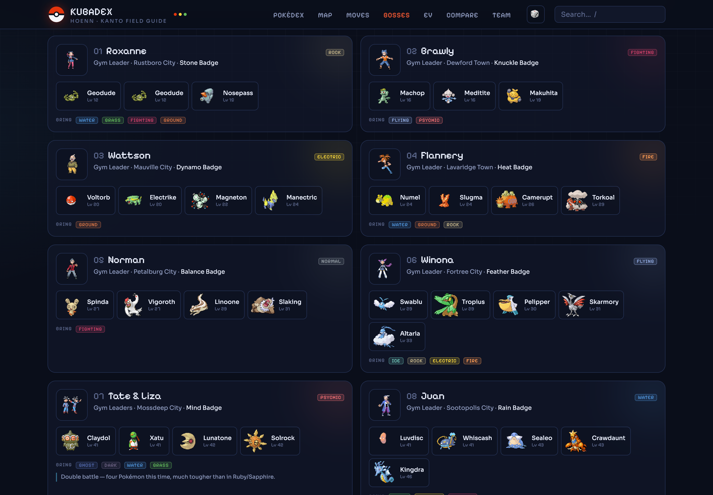
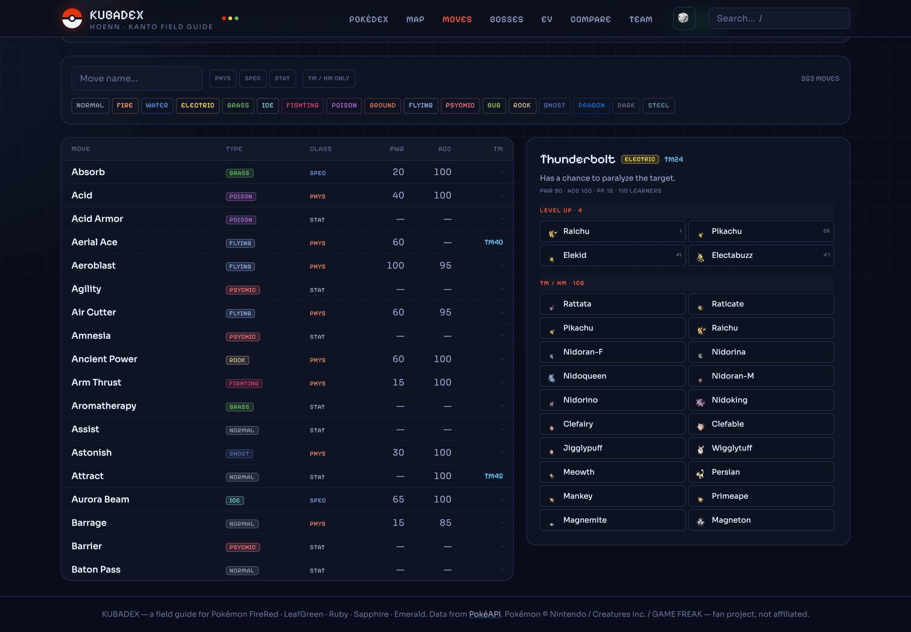
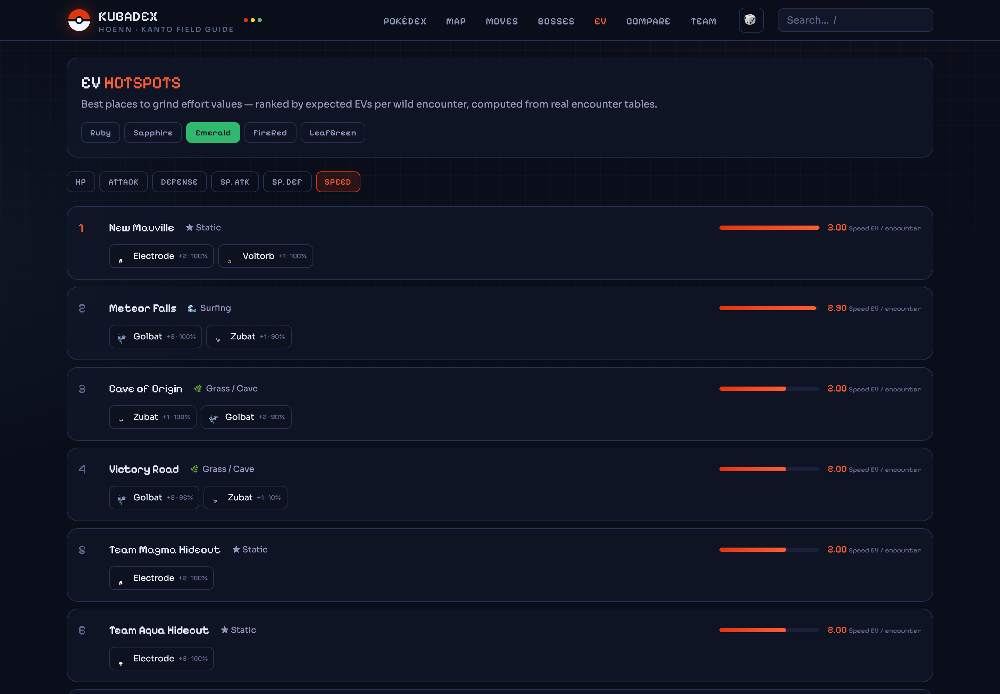

<div align="center">


# KUBADEX

**A field guide for the Game Boy Advance era of Pokémon.**

Complete Pokédex for **FireRed · LeafGreen · Ruby · Sapphire · Emerald** — every Pokémon, every move,
and exactly *where to catch it* on interactive Kanto & Hoenn maps.

[](https://vuejs.org)
[](https://vite.dev)
[](https://tailwindcss.com)
[](https://pinia.vuejs.org)
[](https://pokeapi.co)


<br/>

### [▶ &nbsp;Open KUBADEX — kubadex.vercel.app](https://kubadex.vercel.app)

<br/>



</div>

---

## ✨ What's inside

- **All 386 Pokémon** of Generation III with search, type / game / regional-dex filters and stat sorting
- **🗺 Interactive Town Maps** of Kanto *(+ Sevii Islands)* and Hoenn — locations glow where a Pokémon spawns, with levels, encounter rate and method (grass, surf, rods, Rock Smash…)
- **One game-version switch** that re-themes the whole entry: dex text, game sprite, encounters and moveset follow your game — and the choice is remembered
- **Map Explorer** — reverse lookup: click any route, cave or city and see every wild Pokémon there, per version
- **Evolution trees** that handle every Gen 3 oddity: branching Eevee & Wurmple, Feebas beauty, Shedinja's empty-slot trick
- **Compare tool** — up to three Pokémon: stat radar, side-by-side bars, damage-taken table
- **Team Builder** — six slots, shared-weakness warnings, STAB coverage gaps and per-version availability, saved locally
- **🏆 Gym & League guide** — every boss of all five games in order, with exact teams, levels and auto-computed "bring these types" hints (Emerald's Juan and double-battle twists included)
- **Movedex** — all 353 moves with TM/HM numbers per version and reverse lookup: pick a move, see everyone who learns it
- **EV hotspots** — best grinding spots per stat, ranked by expected EVs per encounter straight from the encounter tables
- **Catch calculator** — exact Gen 3 capture formula on every page: HP, status, all the ball types
- **▶ Authentic GBA cries** — every Pokémon plays its original Game Boy Advance cry
- **Curated event notes** — starters, fossils, gift Pokémon, roamers, Mew, Deoxys, Lugia/Ho-Oh and friends

## 🎯 Built for Gen 3 — not a generic dex

Most Pokédex sites show *modern* mechanics. KUBADEX shows the games as they actually were in 2002–2004:

| | |
|---|---|
| 🚫 **No Fairy type** | 17-type chart — Gardevoir is pure Psychic, Mawile is pure Steel, Charm is Normal |
| 👊 **Physical / Special by type** | Pre-Gen 4 rules: Fire = special, Ghost = physical… shown per move, the way the engine computed it |
| 🕹 **Authentic sprites** | Real GBA sprites (Emerald + FireRed/LeafGreen + shiny), pixel-perfect rendering |
| 🧬 **Per-version everything** | Dex entries, encounter tables and movesets switch between R/S, Emerald and FR/LG |

## 📸 Tour

### Pokémon entry
Game-version selector at the top drives the whole page — sprite, dex text, encounters and moves.



### Where to find — on a real map
Pikachu in FireRed: Viridian Forest and the Power Plant light up. Hover any marker for levels and odds.



### Map Explorer
Click Route 119 → the full encounter table, fishing rods and the infamous six hidden Feebas tiles included.



### Compare
The classic schoolyard argument, settled with a stat radar.



### Team Builder
Spot shared weaknesses and STAB coverage gaps before the Elite Four does.



### Gym & League guide
All boss battles of your version with auto-computed counter-types — switch the game tab and Wallace becomes Juan.



### Movedex
Every move with its Gen 3 TM/HM number — and everyone who learns it, by level, machine, tutor or breeding.



### EV hotspots
Ranked grinding spots per stat, computed from the real encounter tables — New Mauville really is the best Speed farm.



## 🚀 Quick start

```bash
git clone https://github.com/Kubat555/KUBADEX.git
cd KUBADEX
npm install
npm run dev      # → http://localhost:5173
```

The full dataset and all sprites ship with the repo — **no API keys, no backend, works offline.**

```bash
npm run build    # production build → dist/
npm run data     # (optional) regenerate the dataset from PokéAPI
```

## 🛠 How it works

```
scripts/build-data.mjs      PokéAPI → optimized static JSON + GBA sprites & cries (cached, rerunnable)
public/data/                index, per-Pokémon files, moves, abilities, encounters, move-learners
src/data/maps/*.json        hand-authored Town Map grids, slugs match PokéAPI locations
src/data/bosses.json        curated gym / Elite Four / Champion rosters for all three game variants
src/data/specialEncounters  curated notes: starters, fossils, gifts, statics, events
src/lib/typeChart.js        the 17-type Gen 3 effectiveness chart
src/lib/catchRate.js        the exact Gen 3 capture formula
src/views + components      Vue 3 SFCs, Tailwind v4 theme, Pinia for team & version prefs
```

Everything is fetched once at build time and served as static files — page loads are instant and the
site can be hosted on any static hosting (GitHub Pages, Vercel, Netlify…).

## ⚖️ Credits

Data from [PokéAPI](https://pokeapi.co). Pokémon and all respective names are © Nintendo / Creatures Inc. / GAME FREAK Inc.
This is a non-commercial fan project, not affiliated with or endorsed by the rights holders.

<div align="center">
<br/>

**Gotta map 'em all.** 🗺

</div>
